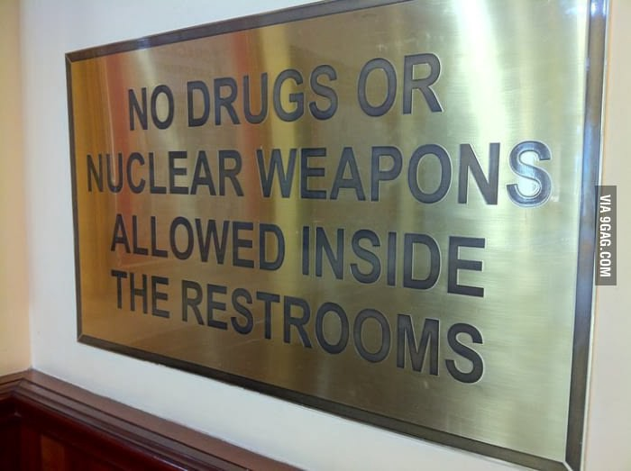

# Разбираемся в политике [методом Фейнмана](https://vk.com/away.php?to=https%3A%2F%2Fknife.media%2Fno-bullshit%2F "Метод Фейнмана")

Когда людей немного — примерно столько, сколько умещается в среднюю пещеру — они очевидным образом зависят друг от друга. Если сегодня я украду у вон того парня стейк, завтра он не защитит меня от нападения саблезубого ленивца. Похожим образом устроены группы и у других животных. Для людей такая система работает, пока плотность населения не превышает одного человека на 20 км²; потом начинается конкуренция и мордобой.

Что делать дальше?

Если личные договоры между людьми больше не работают, нужно придумать общий, который все согласятся соблюдать. Как? Самый очевидный вариант — спросить каждого, какой договор он предпочитает, и выбрать большинством голосов. Противоположный — выбрать человека или группу людей и позволить им принимать решения за всех. В любом случае будут несогласные, которых принуждают жить по правилам, которые они не выбирали. И никто пока не знает, что с этим делать.

Будут и люди, нарушающие правила вне зависимости от согласия с ними. Раньше их можно было просто выгнать: *«Попробуй-ка пожить без наших правил. Нравится?»*. Сейчас это невозможно хотя бы потому, что в любой точке планеты действуют хоть какие-то правила, а отправлять людей в космос дороговато. Что делать с ними — тоже открытый вопрос.

Но общественный договор не может и не должен распространяться на все сферы жизни. Понятно, что решение человека о том, что ему сегодня есть на обед, не затрагивает других (по крайней мере, когда еды достаточно) и потому может приниматься им самостоятельно. Не менее очевидно, что нельзя позволить ему в свое удовольствие [собирать ядерный реактор в гараже](https://geektimes.ru/post/282594/). Но в какую сторону отнести, например, употребление наркотиков?

И вот, наконец, нам удалось построить цивилизацию. Люди более-менее договорились между собой, строят города, пекут хлебушек… Ой, а город-то сгорел. Оказывается, общественный договор, фиксирующий только обязанности, неэффективен. Если один дом в городе загорелся — его нужно потушить как можно скорее, не разбираясь в том, кто его хозяин и может ли он оплатить работу пожарных. Похожая ситуация с инфекционными заболеваниями и прививками: чем больше людей в городе привито, тем выше личная безопасность каждого из них. Можно приводить еще множество примеров, но все они упираются в общую проблему: как оплачивать работу пожарных, вакцины и все остальные издержки? Собирать со всех поровну — плохая идея, потому что кому-то обязательно не хватит денег. Значит, за него придется платить тому, у кого денег больше — по крайней мере, это наиболее рациональное решение.

Чем более развита цивилизация, тем больше богатства она накапливает и тем больше трат может себе позволить. В какой-то момент голод, болезни, нищета и катастрофы перестают быть неизбежностью и становятся вопросом выбора. И этот выбор между жадностью и человечностью определит будущее не только нашей цивилизации, [но и всего космоса](https://arxiv.org/ftp/arxiv/papers/1803/1803.08425.pdf). Как об этом писал Фейнман,

> «Каждому человеку дан ключ от врат рая. Но тот же самый ключ открывает и врата ада»

А теперь, дорогой читатель, можешь расставлять по этому тексту все политические термины, которые знаешь.

Закончил? Молодец, возьми с полки мемчик:

